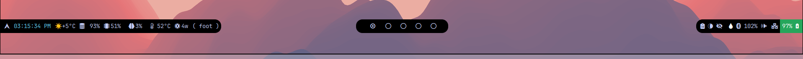

# Waybar Minimal Configuration

## Overview
This README provides a detailed description of the minimal configuration for Waybar, a versatile and customizable status bar for Linux. 

The configuration file included here is designed to offer essential system information and functionalities while maintaining a clean and efficient user interface.

### Modules Configuration

- **Left Modules:** Logo, Clock, Weather, Disk, Memory, CPU, Temperature, Power Draw, Hyperland Windows
- **Center Modules:** Hyperland Workspaces
- **Right Modules:** Tray, Clipboard, Backlight, Idle Inhibitor, Colorpicker, Bluetooth, Pulseaudio, Network, Battery

The configuration file is designed to provide essential system information and functionalities while keeping the interface clean and efficient.
